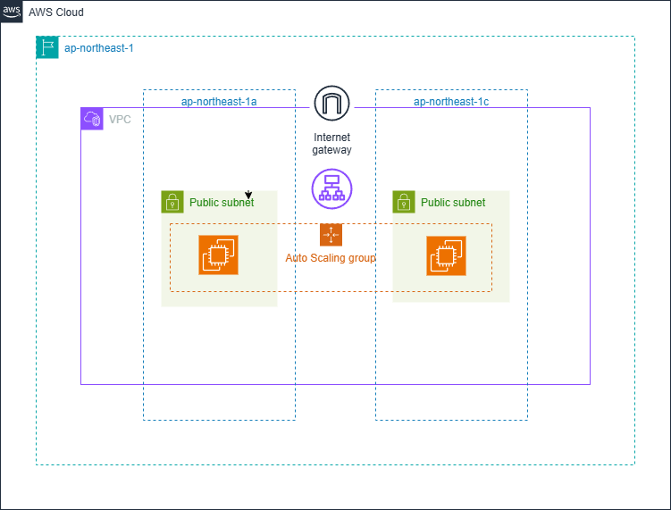

# High-Availability Auto-Scaling Web Infrastructure (AWS CloudFormation)

## 🌐 Project Overview / プロジェクト概要

AWS CloudFormationを使用した、スケーラブルで耐障害性の高いWebインフラの自動構築プロジェクトです。**Nested Stacks（入れ子構造）** を採用することで、各レイヤー（ネットワーク、セキュリティ、アプリ）の独立性を高め、実務レベルの **Infrastructure as Code (IaC)** を実現しています。

This project demonstrates the automation of a production-ready, multi-tier architecture. By leveraging **Nested Stacks**, we ensure high maintainability and modularity in a scalable AWS environment.

---
## 💡 Project Background & Process / 開発の経緯とプロセス

### 🛠 Background / きっかけ
私はインフラエンジニアとしてのバックグラウンドを持っており、実務において環境構築の正確性とスピードがいかに重要かを実感してきました。
「まずは自分が理想とするインフラ環境を、ボタン一つで自動構築できる仕組みを作りたい」という強い動機から、このプロジェクトはスタートしました。手動設定によるヒューマンエラーを排除し、一貫性のあるプロビジョニングを実現することが、私のエンジニアとしての第一歩です。

### 🚀 Process / 開発の流れ
本プロジェクトは、LLM（Gemini）を技術アドバイザーとして活用し、インフラ出身者としての知見と最新の AI 技術を融合させて構築しました。

*   **AI-Assisted IaC Design:** LLM と対話しながら、モジュール化（Nested Stacks）を意識した設計図を作成。インフラ構成のベストプラクティスを議論しながらテンプレートを磨き上げました。
*   **Verification & Review:** 生成されたコードに対し、AWS 公式ドキュメントに基づいた厳格なレビューと動作検証を自ら実施。インフラエンジニアとしての「妥協しない正確性」を重視しました。
*   **Infrastructure Automation:** パッケージングからデプロイまでを Bash スクリプトで自動化。インフラ管理の運用負荷を最小限に抑える設計を追求しました。

## 🚀 Key Features / 主な機能

*   **Modular Architecture (Nested Stacks):** ネットワーク、セキュリティ、アプリケーションの各レイヤーを分離。
*   **High Availability (Multi-AZ):** 2つのAZを利用し、データセンターレベルの障害に対応した冗長構成。
*   **Auto Scaling & Self-Healing:** 負荷に応じた自動増減と、異常インスタンスの自動交換機能を搭載。
*   **Secure Access Management:** SSH(Port 22)を閉じ、**AWS Systems Manager (SSM)** 経由で管理を行うセキュアな設計。
*   **One-Click Deployment:** 複雑なデプロイ工程をシェルスクリプトで完全自動化。

## 🏗 Architecture / 構成図


*Designed with [draw.io](https://app.diagrams.net/)*

* **Public Multi-AZ**: 2つの可用性ゾーン(AZ-a, AZ-c)を利用した高可用性構成。
* **Auto Scaling**: トラフィックに応じて、パブリックサブネット内のインスタンスを自動増減。
* **Elastic Load Balancing**: ALBを使用して外部からのリクエストを効率的に分散。

## 🛠 Tech Stack / 使用技術

*   **IaC:** AWS CloudFormation (YAML), Bash Script
*   **Compute:** EC2 (Amazon Linux 2023), Auto Scaling Group
*   **Networking:** VPC, Public Subnets (Multi-AZ), Internet Gateway, ALB
*   **Security:** IAM Roles/Instance Profiles, Security Groups (SG Chaining)

## 📂 Directory Structure / フォルダ構成

```text
.
├── README.md
├── scripts/
│   └── deploy.sh         # デプロイ自動化スクリプト
└── cloudformation/
    ├── master.yaml       # 全体を統括する親スタック
    ├── network.yaml      # VPC, Subnet, IGW 等
    ├── security.yaml     # Security Groups
    └── app.yaml          # ALB, ASG, Launch Template
```

## 📖 Usage / 使い方

1. AWS CLI のセットアップが完了していることを確認してください。
2. 付属のデプロイスクリプトを実行するだけで、全インフラが構築されます。

```bash
# 実行権限の付与 (初回のみ)
chmod +x scripts/deploy.sh

# デプロイの実行
./scripts/deploy.sh
```

## 💡 Design Decisions / 工夫した点

*   **Naming Consistency:** `SystemName` パラメータを親スタックから各子スタックへ引き渡す設計にし、環境全体のリソース命名規則を一貫させました。
*   **Dynamic AMI Selection:** SSM Parameter Storeを利用し、常に最新の Amazon Linux 2023 AMI を自動的に選択するように構成しています。
*   **Separation of Concerns:** ネットワーク、セキュリティ、アプリ層の責務を明確に分離（Nested Stacks）し、保守性の高いテンプレートを実現しました。